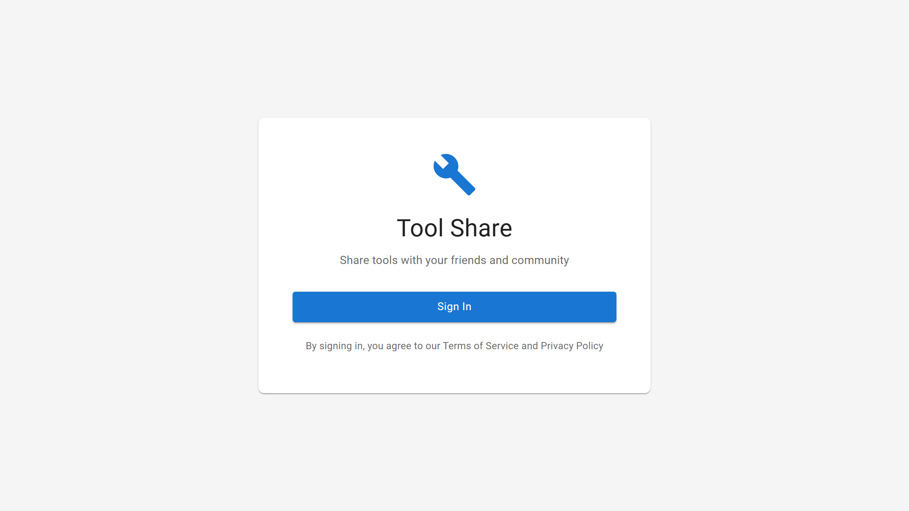

# Tool Share User Guide

Welcome to Tool Share! This guide will help you get started with borrowing and lending tools in your community.

**Table of Contents**
- [Dashboard Overview](#dashboard)
- [Managing Your Tools](#tools)
- [Borrowing & Lending](#reservations)
- [Circles (Sharing Groups)](#circles)
- [Your Profile](#profile)

---

## Dashboard Overview

The dashboard is your home base in Tool Share. It shows your stats, quick actions, and recent activity.

### Dashboard Home

When you log in, you see your personalized dashboard.

- Stats show your tools listed, active loans, and pending requests
- Quick actions let you add tools or browse available tools
- Your recent tools are displayed below

---

## Managing Your Tools

Learn how to add, edit, and manage your tools in the lending library.

### My Tools Page

View all tools you have listed for lending.

- Each tool card shows status, category, and loan settings
- Click a tool to view details or edit

### Add New Tool

Click "Add Tool" to list a new tool.

- Enter tool name, category, and description
- Set advance notice days and maximum loan duration
- Optionally scan a UPC barcode to auto-fill details

### Browse Tools

Browse tools available to borrow from your circles.

- Filter by category or search by name
- Only tools from your circles are shown
- Click a tool to view details and request to borrow

---

## Borrowing & Lending

How to request tools, manage loans, and track reservations.

### Reservations Page

View all your borrowing and lending activity.

- Borrowing tab shows tools you have requested or borrowed
- Lending tab shows requests for your tools

---

## Circles (Sharing Groups)

Circles are groups of trusted people you share tools with.

### My Circles

View circles you belong to.

- Each circle shows member count and your role
- Create a new circle or join an existing one

### Create Circle

Start a new sharing circle.

- Give your circle a name and description
- Choose whether it is public or private
- You become the owner and can invite others

### Join Circle

Join an existing circle with an invite code.

- Enter the 8-character invite code
- Ask the circle owner for the code

---

## Your Profile

Manage your account settings and subscription.

### Profile Page

View and edit your profile information.

- Update your display name, phone, and address
- Add a bio to tell others about yourself
- View your subscription status

### Notifications

View and manage your notifications.

- Filter by notification type
- Click to navigate to related item
- Mark all as read to clear badges

---

## Need Help?

- Check the [FAQ](/faq) for common questions
- Contact support at support@toolshare.example.com

---

*This guide was auto-generated using Playwright. Last updated: 2026-01-19*
